# Verigence Audit Core — Solution Design

**Document ID:** VAC-SD-001  
**Version:** 1.0  
**Status:** BASELINED — Solution Design with documented open business decisions  
**Baseline date:** 2026-08-15  
**Requirements baseline:** `VAC-REQ-001` / `docs/AUDIT_CORE_REQUIREMENTS_BASELINE_v1.0.md`  
**Repository:** `verigence/verigence-audit-core`

> This design does not silently resolve business rules that remain open in VAC-REQ-001. Those rules are represented as configurable/versioned controls or marked as open decisions. This document defines the target architecture and data boundaries; it does not claim that Security or DI currently implements every future integration mechanism described here.

---

## 1. Executive design decision

Audit Core SHALL be implemented initially as a **modular monolith**: one independently deployable Audit Core service/codebase with one Audit Core PostgreSQL database/schema, strong internal domain-module boundaries, REST APIs, a transactional outbox, a lightweight scheduler/worker, and explicit state machines.

Audit Core SHALL **not** use a separate BPM/workflow engine in v1. The v1 process can be represented by:

- explicit business state machines;
- durable `work_items` for human actions;
- due dates/ownership/priority/escalation metadata;
- rule evaluation that creates findings/work;
- scheduled jobs for EOD, ageing and reminders;
- transactional outbox events for loose coupling.

This avoids premature infrastructure and licensing/operational cost while retaining a clean future migration path to a dedicated Workflow service if process complexity justifies it.

Audit Core SHALL remain separate from:

- **Verigence Security** — identity, authentication, effective permissions, sessions, registered-device/geo/time access controls;
- **Verigence DI** — document/evidence storage, quality, extraction and document verification;
- **Verigence Observability** — logging, monitoring and analytics telemetry;
- **Web/Mobile** — presentation and device capability access.

---

## 2. Design goals

The solution SHALL:

1. represent Project → Dealer → Outlet operating landscapes;
2. preserve Project and business assignment history;
3. support OEM/model/variant/colour masters and effective-dated commercial masters;
4. use Booking/Audit Case as the transaction audit aggregate;
5. preserve the provenance of audit-relevant facts;
6. avoid re-keying facts already available from authoritative evidence;
7. support Booking, Delivery, Payment, Insurance/VAS, Trade-In, Daily/EOD, CRM, Escalation and Audit Review processes;
8. keep business state separate from review/workflow state;
9. keep Security and DI loosely coupled through contracts, never database reads;
10. support multi-Tenant isolation from day one;
11. use configuration/versioning for changing OEM/Project rules;
12. provide durable domain events without requiring a message broker at launch;
13. be scalable enough to split bounded contexts into services later without redesigning the domain model.

### 2.1 Non-goals for v1

The following are explicitly not v1 design goals:

- a generic BPMN workflow engine;
- a generic no-code rule language;
- replacing dealer DMS/CRM/accounting systems;
- storing raw KYC/document binaries in Audit Core;
- duplicating Security identity/RBAC tables;
- duplicating DI extraction/document stores;
- making Observability the source of truth for business facts;
- solving open business formulas by assumption.

---

## 3. Platform context and module boundaries

```text
                            Web / Mobile
                                |
                 Security-issued Access JWT
                                |
              +-----------------+-----------------+
              |                                   |
              v                                   v
     +-------------------+               +-------------------+
     |    AUDIT CORE     |<------------->|        DI         |
     |                   |   API/links    |                   |
     | Project/Dealers   |               | Subjects          |
     | Booking/Delivery  |               | Documents         |
     | Payments/Trade-In |               | Extraction        |
     | Controls/Findings |               | Verification      |
     | EOD/CRM/Work      |               | Content           |
     +---------+---------+               +-------------------+
               |
               | logs/metrics/traces + governed events
               v
     +-------------------+
     |  OBSERVABILITY    |
     +-------------------+

               Future if justified
     +-------------------+
     |     WORKFLOW      |
     +-------------------+
```

### 3.1 Authority boundaries

| Concern | Authoritative module |
|---|---|
| User identity/authentication/session/device/geo | Security |
| Effective platform permission | Security |
| Project/Dealer/Outlet business scope | Audit Core |
| OEM/product/commercial masters | Audit Core |
| Booking/Audit Case business state | Audit Core |
| Payment/delivery/trade-in business facts | Audit Core |
| Business controls/findings/review decisions | Audit Core |
| Raw document content | DI |
| Document processing/extracted field/verification state | DI |
| Operational telemetry and telemetry analytics | Observability |

Audit Core SHALL store foreign identifiers from Security/DI as references only; it SHALL NOT create database foreign keys into those services.

---

## 4. Architectural style

### 4.1 Modular monolith

The initial service SHALL use internal modules/bounded contexts with one deployable runtime. A recommended code structure is:

```text
src/verigence_audit_core/
  api/
  auth/
  project/
  masterdata/
  customer/
  case/
  evidence/
  payment/
  delivery/
  insurance/
  trade_in/
  controls/
  review/
  daily_ops/
  crm/
  work/
  events/
  audit_trail/
  integrations/
    security/
    di/
    observability/
  persistence/
```

No module SHALL directly manipulate another module's tables through ad-hoc SQL from business code. Cross-module behavior inside Audit Core SHOULD use application/domain interfaces even though the physical database is shared.

### 4.2 Hexagonal boundaries

External dependencies SHALL be behind adapters/interfaces:

- Security JWT/JWKS verifier;
- DI client;
- event publisher/outbox dispatcher;
- clock/scheduler;
- optional DMS/import adapters;
- Observability telemetry exporter.

This prevents domain code from depending directly on Railway, Neon, a future broker, a specific HTTP client, or DI implementation details.

### 4.3 Technology direction

To minimize platform sprawl, the implementation SHOULD align with the existing backend platform direction where practical (Python 3.12+, FastAPI-style HTTP APIs, PostgreSQL, container deployment). This is an engineering choice, not a business requirement. The domain/API contracts and PostgreSQL schema are the authoritative design outputs of this baseline.

---

## 5. Bounded contexts and domain ownership

### 5.1 Project & Organisation

Owns:

- Project lifecycle;
- OEM/product-category association;
- Dealers and Dealer Outlets;
- Project-to-Dealer/Outlet participation;
- Onsite/Satellite classification;
- Verigence Project assignments and business scopes;
- dealership participant references.

Does not own user authentication or platform permissions.

### 5.2 Product & Commercial Master Data

Owns:

- OEM → Model → Variant → Colour/product SKU hierarchy;
- effective availability;
- commercial component catalogue;
- price-list versions/items;
- discount schemes, eligibility and benefits;
- business lookup values;
- document requirement profiles;
- audit control definitions/versions/project bindings.

### 5.3 Customer

Owns the minimal customer business reference required to group bookings, duplicate-check and support operations. KYC originals remain in DI.

The Customer is Tenant-scoped and MAY have multiple Audit Cases/Bookings.

### 5.4 Audit Case / Booking

This is the **primary transaction aggregate**. It owns:

- booking reference/date/intimation;
- Project/Dealer/Outlet context;
- customer association;
- business stage;
- PC ownership;
- classification/deal source/reference data;
- selected product configuration;
- effective master/profile snapshots/references;
- lifecycle progression.

It does not own document binaries.

### 5.5 Evidence Coordination

Owns the Audit Core side of evidence requirements and DI references:

- case document-requirement snapshots;
- DI subject mapping through Customer;
- DI document references;
- business evidence type/purpose;
- cached non-authoritative DI status for display/operational use;
- provenance linkage from business facts/findings to evidence.

### 5.6 Payments & Finance

Owns payment/receipt, source, payment verification, finance/DO/PO business facts and reconciliation state.

### 5.7 Delivery & Vehicle

Owns planned/intimated/actual delivery, physical-verification business state, VIN/chassis/DMS/registration business references and delivery readiness/completion.

### 5.8 Insurance, Accessories & VAS

Owns insurance business facts and selected/actual RSA, EW, Service Package, accessories and configurable value-added-service records.

### 5.9 Trade-In

Owns the trade-in/exchange lifecycle, linked vehicle/business values, handover/payment/ageing state and related audit facts.

### 5.10 Controls & Findings

Owns deterministic/configured audit evaluations and findings. It consumes facts from Audit Core and evidence-derived facts from DI but is the authority for **business compliance outcomes**.

DI extraction confidence does not itself constitute a business breach.

### 5.11 Review

Owns PC submission and TL review decisions such as `BREACH`, `NO_BREACH`, `SEND_BACK`, with immutable decision history.

### 5.12 Daily Operations / EOD

Owns daily visit/run records, gate-register and source collection, daily reconciliation checks, PC/TL activity tracking and PC notes.

### 5.13 CRM & Escalation

Owns customer/verification interaction records and Project business escalation records. It does not replace a general CRM product.

### 5.14 Work Management

Owns lightweight durable work items generated by case progression, rules, reviews, CRM triggers, EOD and escalations.

### 5.15 Audit Trail & Events

Owns:

- immutable/tamper-evident Audit Core action history;
- transactional outbox for integration events;
- inbox deduplication for future inbound events.

---

## 6. Aggregate design

### 6.1 Project aggregate

Root: `Project`

Key invariants:

- belongs to exactly one Tenant;
- initial baseline references one OEM and one Product Category;
- only ACTIVE Projects accept new Audit Cases;
- effective-dated assignments/configuration do not rewrite historical actions.

Associated aggregates/entities: ProjectDealer, ProjectOutlet, ProjectAssignment.

### 6.2 Commercial configuration aggregates

Each published master version is treated as immutable business configuration.

Roots include:

- PriceList;
- DiscountScheme;
- DocumentRequirementProfile;
- AuditControlVersion.

`DRAFT -> PUBLISHED -> RETIRED` is the default master lifecycle. Published configuration SHALL NOT be overwritten in place; a new version is created.

### 6.3 Customer aggregate

Root: `Customer`

Stores only business-operational/customer-matching data required by Audit Core. Full Aadhaar/PAN/KYC scans are not stored here. Duplicate detection SHOULD use normalized/deterministic protected matching values rather than logging or unnecessarily persisting raw identifiers.

A Customer may have many Audit Cases and maps to at most one active DI Subject per Tenant/customer identity record.

### 6.4 Audit Case aggregate

Root: `AuditCase`

Core children/references:

- CaseProductDetails;
- CaseCommercialLine;
- CaseDiscount;
- CaseDocumentRequirement;
- Payment;
- FinanceRecord;
- DeliveryRecord;
- InsuranceRecord;
- CaseAddon;
- TradeInCase;
- EvidenceLink references;
- AuditEvaluation/Finding references.

The aggregate SHALL use optimistic concurrency/versioning for material commands.

### 6.5 Finding aggregate

Root: `AuditFinding`

A finding SHALL preserve:

- control/evaluation source;
- severity;
- result/category;
- expected and observed evidence/facts;
- evidence references;
- current finding status;
- resolution reason/actor/time;
- immutable event/decision history.

### 6.6 Work Item aggregate

Root: `WorkItem`

Represents a human action, not business truth. Typical types include:

- `PC_CASE_ACTION`;
- `TL_REVIEW`;
- `CRM_CALL`;
- `PAYMENT_FOLLOWUP`;
- `DOCUMENT_FOLLOWUP`;
- `TRADE_IN_FOLLOWUP`;
- `EOD_ACTION`;
- `ESCALATION_ACTION`.

### 6.7 Daily Operations Run aggregate

Root: `DailyOpsRun`

Represents a PC/outlet/business-date operating session and its reconciliation items/evidence.

---

## 7. State model

A single giant status enum SHALL NOT be used. Audit Core uses orthogonal state dimensions so business lifecycle, work ownership and audit outcome cannot contradict one another.

### 7.1 Project state

```text
DRAFT -> ACTIVE -> SUSPENDED -> ACTIVE
                  |              |
                  +-----> CLOSED <+
```

`CLOSED` is terminal for new business creation, while historical data remains readable under permission/retention rules.

### 7.2 Audit Case business stage

```text
BOOKING
   -> ACTIVE
   -> PRE_DELIVERY
   -> DELIVERY
   -> POST_DELIVERY
   -> CLOSED

Any non-closed stage -> CANCELLED (with reason and audit event)
```

`ACTIVE` represents the period after booking audit acceptance while payment/finance/trade-in and delivery preparation evolve.

### 7.3 Audit Case review state

Separate from business stage:

```text
PC_IN_PROGRESS
   -> PC_SUBMITTED
   -> TL_REVIEW
      -> SENT_BACK -> PC_IN_PROGRESS
      -> REVIEW_COMPLETE
```

### 7.4 Audit outcome

Separate from review state:

- `PENDING`
- `NO_BREACH`
- `BREACH`

A `SEND_BACK` action is a review workflow state, not an audit outcome.

### 7.5 Finding state

```text
OPEN -> ACKNOWLEDGED -> RESOLVED
  \                         /
   +------> VOIDED <--------+
```

Reopening, if later required, SHALL create an auditable state transition rather than overwrite the previous resolution.

### 7.6 Payment verification state

At booking/case level:

- `PENDING`
- `PARTIALLY_VERIFIED`
- `VERIFIED`
- `EXCEPTION`

Individual payment records use:

- `PENDING`
- `VERIFIED`
- `REJECTED`
- `EXCEPTION`

### 7.7 Delivery state

- `NOT_PLANNED`
- `PLANNED`
- `INTIMATED`
- `READY_FOR_AUDIT`
- `AUDIT_IN_PROGRESS`
- `DELIVERED`
- `EXCEPTION`
- `CANCELLED`

### 7.8 Trade-In state

- `NOT_APPLICABLE`
- `IDENTIFIED`
- `VEHICLE_HANDED_OVER`
- `VERIFICATION_PENDING`
- `VERIFIED`
- `PAYMENT_PENDING`
- `COMPLETED`
- `EXCEPTION`
- `CANCELLED`

The exact 60/90-day ageing threshold remains configuration/open-decision driven.

### 7.9 Work Item state

```text
OPEN -> IN_PROGRESS -> COMPLETED
  |          |             |
  +------> CANCELLED <-----+
  |
  +------> EXPIRED
```

`OVERDUE` SHOULD be derived from `due_at_utc` and current state rather than used as a separate persisted state.

---

## 8. Lightweight workflow decision

### 8.1 Decision

**No separate Workflow service/engine is required for Audit Core v1.**

The process baseline is structured and mostly deterministic. It can be implemented with state transitions plus durable work items without introducing BPMN infrastructure.

### 8.2 Lightweight workflow components

1. **State transition service** — validates allowed transitions and business preconditions.
2. **Work Item store** — durable assignment, role, principal, priority and due date.
3. **Rule/trigger service** — creates work items/findings for configured conditions.
4. **Scheduler** — handles EOD, due/ageing checks and reminder/escalation creation.
5. **Transactional outbox** — publishes business events after commit.
6. **Idempotency store** — prevents duplicate command/event execution.

### 8.3 Example

```text
PC submits completed case
  -> case.review_state = PC_SUBMITTED
  -> create TL_REVIEW work item
  -> outbox: audit.case.pc_submitted

TL chooses SEND_BACK
  -> append review decision
  -> review_state = SENT_BACK
  -> close TL work item
  -> create PC_CASE_ACTION work item
  -> outbox: audit.case.sent_back
```

### 8.4 When to introduce a separate Workflow service

A dedicated Workflow capability SHOULD be introduced only when one or more of these become material:

- runtime-configurable multi-branch process definitions;
- many parallel approval chains;
- cross-module long-running orchestration/sagas;
- customer-specific workflows changing independently of Audit Core releases;
- complex SLA calendars and escalations across many teams;
- process-version migration for in-flight instances;
- non-technical users must model flows visually;
- work orchestration becomes independently scalable/operated.

The v1 Work Item API/event boundary is deliberately designed so those capabilities can later move to `verigence-workflow` without moving Audit Core business state.

---

## 9. Master-data architecture

### 9.1 Scope

Master data is Tenant-owned in v1 unless explicitly defined otherwise. This avoids cross-Tenant governance coupling and keeps isolation simple. One Tenant can reuse its OEM/product catalogue across multiple Projects.

### 9.2 Product hierarchy

```text
OEM
  -> Model
      -> Variant
          -> Product SKU / sellable configuration
                -> Colour
                -> Fuel/Powertrain attributes
```

A `product_sku` is the stable pricing/booking selection unit and may represent a Model/Variant/Colour combination plus optional attributes.

### 9.3 Versioned commercial masters

Price Lists, Discount Schemes, Document Requirement Profiles and Audit Controls SHALL support:

- `version_no`;
- lifecycle (`DRAFT`, `PUBLISHED`, `RETIRED`);
- `effective_from` / `effective_to`;
- immutable published version semantics;
- created/published actor and time;
- Project applicability.

### 9.4 Price lists

A Price List contains component-level standard values for Product SKUs. The component catalogue is configurable so OEM-specific charges can be added without schema changes.

Examples: EX_SHOWROOM, REGISTRATION, INSURANCE, TCS, EW, RSA, SERVICE_PACKAGE, GENUINE_ACCESSORY, NON_GENUINE_ACCESSORY, GREEN_TAX, HP_CHARGE, OTHER.

### 9.5 Discount schemes

A Discount Scheme SHALL support:

- type/category;
- effective period;
- benefit amount/percentage or configured benefit model;
- eligibility by Project, Dealer, Outlet, Model, Variant, SKU, Colour/customer type and other approved dimensions;
- precedence/combinability metadata when later approved.

The baseline does not invent unresolved Total Discount/Above Scheme formulas. Those remain evaluator configuration/open decisions.

### 9.6 Document Requirement Profiles

Audit Core owns **business evidence requirements**. DI owns document processing/extraction.

A published Project Document Requirement Profile snapshots which document types are required/conditional/optional by stage/condition. When an Audit Case reaches a stage, Audit Core creates `case_document_requirements` from the effective profile.

This is intentionally separate from DI's extraction/quality configuration.

### 9.7 Audit Control versions

A control consists of:

- stable `control_key`;
- version;
- evaluator key selected from implemented, tested evaluators;
- structured configuration (`rule_config`);
- severity/default applicability;
- effective period/project binding.

Audit Core SHALL **not** execute arbitrary code/expression strings stored in the database. Evaluator keys map to reviewed code; configuration supplies thresholds/parameters.

### 9.8 Snapshot/reproducibility rule

For every material evaluation, Audit Core SHALL preserve either the exact version references or a configuration snapshot sufficient to reproduce why an outcome was reached.

---

## 10. Security integration and role mapping

### 10.1 Verified Security contract used by this design

Audit Core will trust only Verigence Security Access JWTs verified using Security JWKS. The current Security contract uses RS256 and includes required claims such as:

- `iss` (currently `verigence-security`);
- `aud` (currently `verigence-platform`);
- `sub` principal ID;
- `actor_type`;
- `tenant_id`;
- `access_session_id`;
- `permissions[]`;
- `iat`, `exp`, `jti`;
- for USER actors, Security additionally carries roles/device/location context.

Audit Core SHALL enforce permissions, not caller-supplied role claims.

### 10.2 Security versus business scope

Security determines **may this principal perform this capability in the Tenant?**

Audit Core additionally determines **may this principal perform it for this Project/Dealer/Outlet?**

Security `location_id` is a Security access/geo concept and SHALL NOT be overloaded to mean Dealer Outlet. Dealer Outlet is an Audit Core business entity.

### 10.3 Proposed Audit Core permission catalogue

The canonical proposal is stored alongside this design in `design/AUDIT_CORE_SECURITY_CATALOG_v1.0.json`.

High-level permission families:

- `audit.project.*`
- `audit.master.*`
- `audit.case.*`
- `audit.evidence.*`
- `audit.payment.*`
- `audit.delivery.*`
- `audit.trade_in.*`
- `audit.finding.*`
- `audit.review.*`
- `audit.daily_ops.*`
- `audit.crm.*`
- `audit.escalation.*`
- `audit.analytics.*`

Security registration of that catalog is a future Security integration change; this design does not modify Security.

### 10.4 Business role templates

Proposed role-to-capability intent:

| Business role | Audit Core intent | DI intent |
|---|---|---|
| PC | assigned case operations, evidence coordination, payments/delivery/trade-in checks, daily ops, observations | Subject/document create/read/upload/content/fields/quality as operationally required |
| TL | PC capabilities where assigned + TL review/send-back/breach decision + team activity view | document/evidence read and verification where policy permits |
| PM | project-wide read/oversight, finding/escalation management, analytics | operational/read visibility as required |
| CRM | CRM work queue/interactions and case context needed for calls | limited evidence read only if explicitly required |
| Executive | project-level read/analytics/oversight | normally no document-content access unless separately granted |

The table describes business templates, not immutable authorization. Security remains the effective permission authority.

### 10.5 Actor audit context

Material Audit Core actions SHALL record:

- Security principal ID (`sub`);
- actor type;
- Tenant ID;
- access session ID when applicable;
- correlation ID;
- Audit Core Project/business role context where applicable;
- UTC timestamp.

Audit Core SHALL NOT duplicate Security credentials, sessions or password/OTP data.

---

## 11. DI integration

### 11.1 Verified DI capabilities used by this design

Current DI exposes Tenant-scoped Subject APIs and permission-based document/evidence operations. DI Subject types are currently `PERSON`, `ORGANIZATION`, `OTHER`. DI also supports generic external entity links on documents with `linkType`, `externalEntityId` and `externalSystem`.

### 11.2 Subject mapping decision

A DI Subject SHALL map to the **Audit Core Customer**, not directly to an Audit Case.

Rationale:

- DI Subject semantics are PERSON/ORGANIZATION/OTHER;
- a customer can have multiple bookings;
- the Customer is the real person/organization subject of KYC and many transaction documents;
- individual documents can still be bound unambiguously to a specific Audit Case using DI external entity links and Audit Core `evidence_links`.

Audit Core stores `customers.di_subject_id`. It remains a foreign service identifier, not a database FK.

### 11.3 Audit Case document link

For each document associated with a case, Audit Core SHALL retain an `evidence_link` containing:

- Audit Case ID;
- DI Subject ID;
- DI Document ID;
- document type key;
- business evidence purpose/stage;
- optional requirement snapshot ID;
- cached display status and last synchronization time.

Where available, the DI document SHALL also receive an external entity link:

```json
{
  "linkType": "AUDIT_CASE",
  "externalEntityId": "<audit-case-uuid>",
  "externalSystem": "VERIGENCE_AUDIT_CORE"
}
```

The Audit Core database remains authoritative for the business link; the DI external link provides traceability from the evidence side.

### 11.4 Upload flow — v1 preferred pattern

Because document binaries can be large and DI already owns upload/quality/storage, the Web/Mobile client SHOULD upload document content directly to DI using a Security-issued token containing the required DI permission. Audit Core SHALL not proxy raw binary content merely to forward it to DI.

Recommended flow:

```text
1. Client -> Audit Core: get/create case evidence requirement/context
2. Client -> DI: upload to Customer DI Subject with documentTypeKey
3. Client -> Audit Core: register/link returned DI documentId to Audit Case
4. Audit Core -> DI (request-time/user context where permitted): add external AUDIT_CASE entity link
5. Audit Core refreshes/reads DI document/extracted facts when needed
```

This keeps Audit Core out of the document data path and avoids double network/storage handling.

### 11.5 Automated/background integration

Security currently owns the target machine-identity model (`SYSTEM` / `SERVICE_INTEGRATION` actor types), but background cross-service token issuance must be treated as a dependency until the required Security machine-token capability is operationally available.

Therefore:

- request-time DI operations MAY use the caller's valid Security token if permissions allow;
- automated background DI synchronization SHALL use a Security-issued service identity when available;
- Audit Core SHALL NOT create an independent shared-secret bypass for DI.

### 11.6 DI facts versus Audit Core facts

DI is authoritative for:

- document processing/confirmation state;
- extracted field values and extraction provenance;
- document quality/verification.

Audit Core is authoritative for:

- which evidence is required for a business stage;
- which evidence is associated with an Audit Case;
- standard/actual business comparisons;
- business audit controls and findings.

Audit Core SHALL not delegate final business compliance to a generic DI reconciliation call. DI-derived facts are inputs to Audit Core controls.

### 11.7 Current DI contract insulation

Audit Core SHALL use a `DIClient`/anti-corruption adapter so DI response-envelope or endpoint evolution is isolated from Audit Core domain services. No domain module SHALL parse DI wire formats directly.

### 11.8 Future DI events

No Audit Core v1 design SHALL assume DI currently publishes a broker event contract. If/when DI publishes stable events, Audit Core can consume events such as document processed/confirmed/failed through an inbox adapter. Until then, on-demand refresh or bounded polling MAY be used.

---

## 12. Observability integration

Audit Core SHALL comply with `VOBS-REQ-001` once Observability implementation is available.

Every request/command/event SHOULD carry or generate a platform `correlation_id`. Audit Core telemetry SHALL include, where permitted/applicable:

- tenant_id;
- project_id;
- audit_case_id;
- dealer/outlet identifiers;
- Security principal ID;
- event/action/result;
- latency/error context.

PII, raw document content, OTP/tokens and sensitive identifiers SHALL not be emitted to logs.

Business metrics sent to Observability are derived/aggregated views. Audit Core remains the authoritative source for case/finding state.

---

## 13. API design

### 13.1 General conventions

- base version: `/v1`;
- Tenant explicit in path for business APIs: `/v1/tenants/{tenantId}/...`;
- token Tenant MUST equal path Tenant for Tenant-scoped calls;
- `X-Correlation-ID` propagated/returned;
- UTC timestamps in ISO-8601;
- resource IDs are UUIDs;
- commands that can be retried SHOULD support `Idempotency-Key`;
- material mutable resources SHOULD use optimistic concurrency (`versionNo` / ETag semantics);
- success responses use resource-oriented JSON;
- errors SHOULD use a consistent Problem Details-style object with stable Audit Core `errorCode` and correlation ID. A later platform-wide API standard may supersede presentation format without changing domain semantics.

### 13.2 Project/onboarding APIs

```text
POST   /v1/tenants/{tenantId}/projects
GET    /v1/tenants/{tenantId}/projects
GET    /v1/tenants/{tenantId}/projects/{projectId}
PATCH  /v1/tenants/{tenantId}/projects/{projectId}
POST   /v1/tenants/{tenantId}/projects/{projectId}/activate
POST   /v1/tenants/{tenantId}/projects/{projectId}/dealers
POST   /v1/tenants/{tenantId}/projects/{projectId}/outlets
POST   /v1/tenants/{tenantId}/projects/{projectId}/assignments
GET    /v1/tenants/{tenantId}/projects/{projectId}/assignments
```

### 13.3 Master APIs

```text
/v1/tenants/{tenantId}/oems
/v1/tenants/{tenantId}/product-models
/v1/tenants/{tenantId}/product-variants
/v1/tenants/{tenantId}/product-skus
/v1/tenants/{tenantId}/price-lists
/v1/tenants/{tenantId}/discount-schemes
/v1/tenants/{tenantId}/document-requirement-profiles
/v1/tenants/{tenantId}/audit-controls
```

Versioned masters SHALL expose publish/retire commands rather than allowing silent editing of published rows.

### 13.4 Customer and case APIs

```text
POST   /v1/tenants/{tenantId}/customers
GET    /v1/tenants/{tenantId}/customers/search
POST   /v1/tenants/{tenantId}/projects/{projectId}/cases
GET    /v1/tenants/{tenantId}/projects/{projectId}/cases
GET    /v1/tenants/{tenantId}/projects/{projectId}/cases/{caseId}
PATCH  /v1/tenants/{tenantId}/projects/{projectId}/cases/{caseId}
POST   /v1/tenants/{tenantId}/projects/{projectId}/cases/{caseId}/transition
POST   /v1/tenants/{tenantId}/projects/{projectId}/cases/{caseId}/submit-for-tl
```

### 13.5 Evidence APIs

```text
GET    /v1/tenants/{tenantId}/projects/{projectId}/cases/{caseId}/document-requirements
POST   /v1/tenants/{tenantId}/projects/{projectId}/cases/{caseId}/evidence-links
GET    /v1/tenants/{tenantId}/projects/{projectId}/cases/{caseId}/evidence-links
POST   /v1/tenants/{tenantId}/projects/{projectId}/cases/{caseId}/evidence-links/{evidenceLinkId}/refresh
DELETE /v1/tenants/{tenantId}/projects/{projectId}/cases/{caseId}/evidence-links/{evidenceLinkId}
```

Deleting an Audit Core link does not delete DI content unless a separately authorized DI operation explicitly does so.

### 13.6 Process APIs

Process subresources SHALL use case-scoped collections/commands, for example:

```text
.../cases/{caseId}/payments
.../cases/{caseId}/finance
.../cases/{caseId}/delivery
.../cases/{caseId}/insurance
.../cases/{caseId}/addons
.../cases/{caseId}/trade-in
.../cases/{caseId}/evaluations
.../cases/{caseId}/findings
.../cases/{caseId}/review-decisions
.../cases/{caseId}/crm-interactions
.../cases/{caseId}/escalations
```

### 13.7 Work APIs

```text
GET    /v1/tenants/{tenantId}/work-items
GET    /v1/tenants/{tenantId}/work-items/{workItemId}
POST   /v1/tenants/{tenantId}/work-items/{workItemId}/claim
POST   /v1/tenants/{tenantId}/work-items/{workItemId}/complete
POST   /v1/tenants/{tenantId}/work-items/{workItemId}/cancel
```

### 13.8 Daily/EOD APIs

```text
POST   /v1/tenants/{tenantId}/projects/{projectId}/daily-ops
GET    /v1/tenants/{tenantId}/projects/{projectId}/daily-ops
POST   /v1/tenants/{tenantId}/projects/{projectId}/daily-ops/{runId}/items
POST   /v1/tenants/{tenantId}/projects/{projectId}/daily-ops/{runId}/complete
GET    /v1/tenants/{tenantId}/projects/{projectId}/activity
POST   /v1/tenants/{tenantId}/projects/{projectId}/activity
POST   /v1/tenants/{tenantId}/projects/{projectId}/daily-notes
```

### 13.9 Analytics/query APIs

Operational query APIs MAY provide read-optimized summaries without becoming a separate analytics source of truth:

```text
GET /v1/tenants/{tenantId}/projects/{projectId}/dashboard
GET /v1/tenants/{tenantId}/projects/{projectId}/findings/summary
GET /v1/tenants/{tenantId}/projects/{projectId}/payment-verification/summary
GET /v1/tenants/{tenantId}/projects/{projectId}/daily-ops/summary
```

---

## 14. Domain events and integration events

### 14.1 Event envelope

Every durable outbox event SHALL contain at minimum:

```json
{
  "eventId": "uuid",
  "eventType": "audit.case.created",
  "schemaVersion": 1,
  "occurredAtUtc": "timestamp",
  "tenantId": "tenant",
  "projectId": "uuid|null",
  "aggregateType": "AUDIT_CASE",
  "aggregateId": "uuid",
  "correlationId": "string",
  "actorId": "security-principal|null",
  "payload": {}
}
```

### 14.2 Initial event catalogue

At minimum:

- `audit.project.created`
- `audit.project.activated`
- `audit.assignment.changed`
- `audit.case.created`
- `audit.case.stage_changed`
- `audit.case.pc_submitted`
- `audit.case.sent_back`
- `audit.case.review_completed`
- `audit.evidence.linked`
- `audit.evidence.unlinked`
- `audit.payment.recorded`
- `audit.payment.verified`
- `audit.delivery.intimated`
- `audit.delivery.completed`
- `audit.finding.opened`
- `audit.finding.resolved`
- `audit.work_item.created`
- `audit.work_item.completed`
- `audit.crm.followup_due`
- `audit.crm.followup_completed`
- `audit.escalation.opened`
- `audit.daily_ops.completed`

### 14.3 Transactional outbox

Domain state and its outbox event SHALL commit in the same PostgreSQL transaction. A dispatcher publishes later. No service shall dual-write database state and a broker/network endpoint in the same business command.

A message broker is **not mandatory for launch**. The outbox provides a durable seam. The initial dispatcher may feed Observability/approved consumers through an adapter; a broker can be introduced later without domain redesign.

### 14.4 Inbox

When Audit Core begins consuming DI/Workflow/other asynchronous events, it SHALL use an inbox/deduplication mechanism keyed by producer/event ID.

---

## 15. Logical data model

### 15.1 Core relationship view

```mermaid
erDiagram
    PROJECT ||--o{ PROJECT_DEALER : includes
    DEALER ||--o{ OUTLET : has
    PROJECT ||--o{ PROJECT_OUTLET : includes
    PROJECT ||--o{ PROJECT_ASSIGNMENT : staffs

    OEM ||--o{ PRODUCT_MODEL : defines
    PRODUCT_MODEL ||--o{ PRODUCT_VARIANT : has
    PRODUCT_VARIANT ||--o{ PRODUCT_SKU : sells
    PRODUCT_SKU }o--|| COLOUR : uses

    PROJECT ||--o{ PRICE_LIST : configures
    PRICE_LIST ||--o{ PRICE_LIST_ITEM : contains
    PROJECT ||--o{ DISCOUNT_SCHEME : configures

    CUSTOMER ||--o{ AUDIT_CASE : books
    PROJECT ||--o{ AUDIT_CASE : owns
    DEALER ||--o{ AUDIT_CASE : handles
    OUTLET ||--o{ AUDIT_CASE : occurs_at

    AUDIT_CASE ||--|| CASE_PRODUCT_DETAILS : selects
    AUDIT_CASE ||--o{ CASE_COMMERCIAL_LINE : prices
    AUDIT_CASE ||--o{ CASE_DISCOUNT : discounts
    AUDIT_CASE ||--o{ CASE_DOCUMENT_REQUIREMENT : requires
    AUDIT_CASE ||--o{ EVIDENCE_LINK : evidenced_by

    AUDIT_CASE ||--o{ PAYMENT : receives
    AUDIT_CASE ||--o{ FINANCE_RECORD : finances
    AUDIT_CASE ||--o| DELIVERY_RECORD : delivers
    AUDIT_CASE ||--o{ INSURANCE_RECORD : insures
    AUDIT_CASE ||--o{ CASE_ADDON : adds
    AUDIT_CASE ||--o| TRADE_IN_CASE : exchanges

    AUDIT_CASE ||--o{ AUDIT_EVALUATION : evaluates
    AUDIT_EVALUATION ||--o{ AUDIT_FINDING : raises
    AUDIT_FINDING ||--o{ FINDING_EVIDENCE_REF : cites
    AUDIT_CASE ||--o{ REVIEW_DECISION : reviewed_by

    AUDIT_CASE ||--o{ WORK_ITEM : drives
    PROJECT ||--o{ DAILY_OPS_RUN : operates
    DAILY_OPS_RUN ||--o{ DAILY_OPS_ITEM : checks
```



### 15.2 Logical entities

#### Organisation/project

- Project
- OEM
- ProductCategory
- Dealer
- DealerOutlet
- ProjectDealer
- ProjectOutlet
- ProjectAssignment
- ProjectAssignmentScope
- DealershipParticipant

#### Master/configuration

- LookupValue
- ProductModel
- ProductVariant
- Colour
- ProductSKU
- CommercialComponentType
- PriceList / PriceListItem
- DiscountScheme / DiscountEligibility / DiscountBenefit
- DocumentRequirementProfile / DocumentRequirementItem
- AuditControlDefinition / AuditControlVersion / ProjectControlBinding

#### Transaction

- Customer
- AuditCase
- CaseProductDetails
- CaseCommercialLine
- CaseDiscount
- CaseDocumentRequirement
- EvidenceLink
- Payment / PaymentEvidenceLink
- FinanceRecord
- DeliveryRecord
- InsuranceRecord
- CaseAddon
- TradeInCase

#### Audit/work

- AuditEvaluation
- AuditFinding
- FindingEvidenceRef
- ReviewDecision
- WorkItem / WorkItemHistory
- CRMInteraction
- Escalation
- DailyOpsRun / DailyOpsItem
- DailyActivityEntry
- DailyNote

#### Platform reliability

- IdempotencyKey
- OutboxEvent
- InboxEvent
- AuditChainHead
- AuditEvent

---

## 16. Data provenance model

Audit Core SHALL explicitly classify the source of audit-relevant values. Recommended `source_kind` values:

- `USER_OPERATIONAL`
- `UPSTREAM_SYSTEM`
- `DI_MACHINE`
- `DI_HUMAN_VERIFIED`
- `SYSTEM_CALCULATED`
- `MASTER_RESOLVED`

Where applicable a fact/line SHALL retain:

- source kind;
- DI document ID and canonical field key, or upstream reference;
- observed time;
- actor/system that accepted it;
- master/control version used to compare it.

Human remarks are not treated as evidence-derived facts.

---

## 17. Physical database design principles

The executable physical baseline is `database/AUDIT_CORE_POSTGRESQL_SCHEMA_v1.0.sql`.

### 17.1 PostgreSQL schema

All Audit Core tables are in the `auditcore` PostgreSQL schema.

### 17.2 Multi-Tenant isolation

Every Audit Core business/configuration table is Tenant-scoped in v1. Tenant ID is included in composite primary/foreign keys.

PostgreSQL Row Level Security SHALL be enabled **and forced** on Tenant tables. Runtime transactions SHALL set:

```sql
SET LOCAL app.tenant_id = '<validated Security token tenant_id>';
```

The runtime DB role SHALL be a non-owner role without `BYPASSRLS`. Migration/owner credentials SHALL be separate from runtime credentials.

This provides defense in depth; API/service logic MUST still use Tenant-aware keys and authorization.

### 17.3 Identifiers and time

- UUIDs are used for internal resource IDs.
- external business references such as Booking Number remain separate strings.
- timestamps are `timestamptz` and stored in UTC.
- Project local business date/time uses the Project time zone for scheduled/daily behavior.

### 17.4 Deletion

Historical audit transactions, evaluations, review decisions and audit events SHALL not be physically deleted through ordinary user APIs. Status/retention policies are preferred.

### 17.5 Published masters

Published price/discount/profile/control versions SHALL be immutable by application policy. Corrections create new versions and preserve previous references.

### 17.6 JSONB use

JSONB is permitted for:

- extensible rule configuration;
- event payloads;
- non-authoritative extension metadata/snapshots.

Core relational facts (Project, Booking, Payment, Product, amounts, statuses) SHALL remain typed relational columns.

### 17.7 Indexing

Indexes prioritize:

- Tenant + Project + status/date case lists;
- booking reference lookup;
- customer duplicate-match hashes;
- assignment/scope lookup;
- work queue lookup;
- open findings;
- payment verification;
- daily operations date/outlet;
- outbox dispatch;
- DI document/reference lookup.

High-volume history/outbox/audit tables can be partitioned later if measured volume justifies it; v1 avoids premature partitioning.

---

## 18. Audit Core authoritative audit trail

Operational logs are insufficient for an audit product. Audit Core SHALL maintain an authoritative business audit trail for material state-changing actions.

The baseline uses entity-scoped tamper-evident chains:

```text
Tenant + EntityType + EntityId
   sequence 1 -> sequence 2 -> sequence 3
     hash         hash           hash
```

Each audit event stores previous hash, event hash, actor/correlation/time/action and a canonical payload. Application code calculates and appends the chain within the same transaction as material business changes where required.

The physical schema prevents ordinary UPDATE/DELETE of `audit_events`; authorization/application policy controls reads.

This trail is separate from Observability logs and from DI/Security audit trails.

---

## 19. Concurrency, idempotency and reliability

### 19.1 Optimistic concurrency

Material aggregates use `version_no`. Updates SHALL verify the expected version to prevent lost updates between PC/TL/PM actions.

### 19.2 Idempotency

Create/command APIs that may be retried SHALL support an idempotency key. The stored result/request hash prevents a duplicate booking/payment/link from being created by network retry.

### 19.3 Scheduler leadership

If multiple Audit Core instances run, scheduled tasks SHALL use a PostgreSQL advisory lock or equivalent single-leader mechanism per scheduled job so EOD/ageing actions are not duplicated.

### 19.4 Work-item uniqueness

Trigger-generated work SHOULD use a deterministic deduplication key (for example Case + WorkType + TriggerVersion) so repeated evaluations do not create duplicate open tasks.

### 19.5 External service failure

Security verification failure fails closed.

DI unavailability SHALL not corrupt Audit Core state. Existing business records remain accessible subject to authorization; DI-dependent actions return a dependency/degraded result and may create retryable work. Audit Core SHALL never fabricate extracted evidence because DI is unavailable.

Observability unavailability SHALL not normally block business operations.

---

## 20. Duplicate booking/customer matching

Duplicate detection SHALL be a staged control, not a single fuzzy verdict.

Recommended approach:

1. exact deterministic matches on protected normalized identifiers where available (PAN/GST/mobile and approved Aadhaar-derived match token);
2. strong combinations approved by the business;
3. weaker combinations such as surname + pincode create `REVIEW_REQUIRED`, not definitive identity;
4. results are Project/Tenant scoped according to approved rules;
5. match reasons/evidence are recorded in the evaluation/finding.

Audit Core SHOULD store deterministic keyed hashes for sensitive match identifiers rather than persist raw Aadhaar/PAN merely to perform duplicate detection. Raw KYC evidence remains in DI.

---

## 21. Rule evaluation model

### 21.1 Inputs

Evaluators consume typed facts from:

- Audit Core transaction tables;
- published master versions;
- DI-extracted/verified facts through the DI adapter;
- approved upstream source adapters;
- previous evaluation state where explicitly required.

### 21.2 Output

Every evaluation returns one of:

- `PASS`
- `FAIL`
- `REVIEW`
- `NOT_APPLICABLE`
- `ERROR`

and records expected/observed/configuration context.

### 21.3 Finding creation

A Control Version defines whether `FAIL` or `REVIEW` creates a Finding, its default severity, and optional Work Item/CRM/Escalation trigger.

### 21.4 No hidden GenAI business verdicts

GenAI/document intelligence MAY extract evidence. It SHALL NOT silently decide final audit compliance. Business audit outcomes use explicit, versioned rules or an auditable human decision.

---

## 22. Daily/EOD design

Daily Operations are native Audit Core behavior, not a separate workflow product.

For each business date/outlet/PC, a `DailyOpsRun` can track:

- gate-out register evidence;
- expected/observed delivery count;
- booking/retail/delivery dumps;
- cash ledger/bank statement evidence;
- previous-day exception review;
- configured common-booking-amount scans;
- unresolved follow-ups;
- completion and TL oversight.

`DailyOpsItem` is a configurable checklist/reconciliation result. The exact formulas and source-system automation can evolve without changing the run aggregate.

PC/TL productivity/activity data is stored separately from audit truth so productivity metrics do not alter case compliance.

---

## 23. CRM and escalation design

### 23.1 CRM

CRM work is event/condition driven. Examples from the baseline include Self Insurance and month-end cash payment. A trigger creates a `CRM_CALL` Work Item; `CRMInteraction` records attempts/outcome.

CRM SLA/category values remain configuration/open decision until approved.

### 23.2 Escalation

`Escalation` is a first-class Project business record linked to Case/Finding/Work Item as applicable. Escalation severity, owner and status are explicit; it does not mutate the underlying Finding automatically.

---

## 24. Scalability and future decomposition

The modular monolith is intentionally designed for later extraction.

Likely future service candidates, only if independently needed:

- Workflow/Work Management;
- Commercial Master service if shared across many products/domains;
- Analytics read platform;
- Notifications.

Extraction can use the existing application interfaces/outbox boundaries. The initial design avoids distributed transactions and cross-service database joins, which is the key prerequisite for safe later decomposition.

Scale tactics before service splitting:

- stateless API instances;
- PostgreSQL connection pooling;
- targeted indexes;
- asynchronous rule/outbox workers;
- bounded background concurrency;
- read-optimized materialized views/read replicas when measured need arises;
- partition only the history/event tables when volumes justify it.

---

## 25. Open decisions preserved from VAC-REQ-001

The design intentionally does not invent final values/formulas for:

- PM versus PMO canonical terminology;
- Satellite outlet monthly-volume threshold and auto/manual classification policy;
- Deal Type canonical values;
- Registration Type/category naming;
- Trade-In 60 versus 90 day ageing requirement;
- PO/DO/Refund realised-amount logic;
- Short/Excess formula;
- per-car Total Discount formula;
- Above Scheme formula;
- Deemed DSA rule;
- CRM SLA and final call categories;
- final Project/OEM document requirement matrix;
- any customer-specific/OEM-specific tolerance not explicitly approved.

These SHALL be resolved by versioned requirement/design decisions and, where appropriate, represented as published master/control configuration.

---

## 26. Requirements-to-design traceability

| Requirements area | Primary design sections |
|---|---|
| VAC-BP-* principles | 3, 4, 9, 16–21 |
| VAC-PRJ-* onboarding | 5.1, 6.1, 10, 15 |
| VAC-ROLE-* / VAC-DLR-* | 5.1, 10 |
| VAC-MST-* / VAC-PRICE-* / VAC-DISC-* | 5.2, 6.2, 9 |
| VAC-BKG-* | 5.3–5.5, 6.3–6.4, 7, 20 |
| VAC-DEL-* | 5.7, 7.7, 13.6 |
| VAC-PAY-* | 5.6, 7.6, 13.6, 21 |
| VAC-INS/VAS/ACC-* | 5.8, 13.6 |
| VAC-DAY-* | 5.12, 6.7, 22 |
| Trade-In | 5.9, 7.8, 13.6 |
| Escalation/CRM | 5.13, 23 |
| System validation/audit observations | 5.10, 6.5, 21 |
| Security integration | 10 |
| DI/evidence integration | 11 |
| Observability | 12 |
| Workflow decision | 8 |
| Logical/physical data | 15–18 + physical SQL baseline |

---

## 27. Implementation sequencing recommended by this design

The design does not require all domains to be coded simultaneously. Recommended vertical increments:

1. **Foundation:** service skeleton, Security verification/JWKS, Tenant/RLS transaction context, correlation, migrations, audit/outbox/idempotency.
2. **Project Onboarding:** OEM/product basics, Project, Dealer/Outlet, assignments/scopes.
3. **Commercial Masters:** product SKU, price list, discount scheme, lookups, publish/versioning.
4. **Customer + Booking Case:** case aggregate, duplicate matching, state transition, PC work queue.
5. **DI Evidence Integration:** Customer DI Subject mapping, case requirements, evidence links/status/fact adapter.
6. **Controls/Findings + TL Review:** evaluator framework, finding lifecycle, review decisions/send-back.
7. **Payments/Finance.**
8. **Delivery/Insurance/VAS.**
9. **Trade-In.**
10. **Daily/EOD + CRM/Escalations.**
11. **Operational analytics/Observability integration.**
12. **Hardening:** performance, retention, failure recovery, full E2E and security/tenant-isolation tests.

Each increment SHALL be acceptance-tested against the relevant VAC-REQ-001 requirements before being marked complete.

---

## 28. Baseline governance

This document is the **Audit Core Solution Design v1.0** for `VAC-REQ-001`.

Material design changes SHALL be documented with rationale and affected requirement/interface/schema sections. Open business decisions are not silently considered approved because a placeholder exists in the schema.

The following companion artifacts form this design package:

- `docs/AUDIT_CORE_SOLUTION_DESIGN_v1.0.md` — authoritative architecture/domain design;
- `database/AUDIT_CORE_POSTGRESQL_SCHEMA_v1.0.sql` — physical PostgreSQL baseline;
- `design/AUDIT_CORE_SECURITY_CATALOG_v1.0.json` — proposed Security module permission/role-template catalog for later Security registration;
- `DESIGN_BASELINE_MANIFEST.md` — immutable reference manifest for the package.
