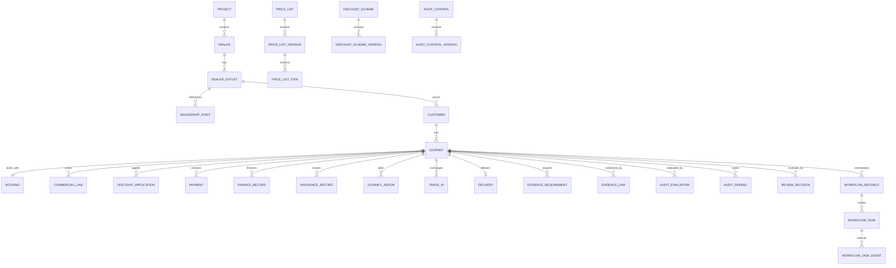

# Verigence Audit Core — Consolidated Solution Design

**Document ID:** VAC-SD-002  
**Version:** 2.0  
**Status:** DRAFT FOR REVIEW — candidate to supersede VAC-SD-001 v1.0 after owner approval  
**Date:** 2026-08-15  
**Requirements:** `VAC-REQ-001 v1.0` + `VAC-REQ-ADD-001 v1.1`  
**Reconciliation register:** `VAC-DR-002 v2.0`  
**Repository:** `verigence/verigence-audit-core`

> This design is intentionally grounded only in the supplied SPR process workbooks, explicit project-owner corrections, the supplied third-party design ZIP, and verified current Security/DI contracts. Open business rules are listed as open; they are not guessed.

---

## 1. Executive architecture decision

Audit Core is the core business module for the audited vehicle-sale journey. It SHALL initially be implemented as a **modular monolith** with a PostgreSQL database, explicit bounded contexts, durable workflow/tasks, REST APIs, deterministic/versioned audit controls, transactional outbox/inbox, and adapters to Security, DI, Observability and external providers.

The foundational hierarchy is:

```text
PROJECT (= VERIGENCE SECURITY TENANT)
  -> DEALER
      -> DEALER OUTLET / LOCATION
          -> CUSTOMER
              -> CUSTOMER / AUDIT JOURNEY
                  -> Booking
                  -> Commercials / Discounts
                  -> Payments / Finance
                  -> Insurance / VAS
                  -> Trade-In
                  -> Vehicle / Registration
                  -> Delivery
                  -> Evidence / Documents
                  -> Audit Controls / Findings
                  -> Review / CRM / Escalation
                  -> Durable Workflow Tasks
```

The Journey is the lifecycle coordinator. **Booking starts the journey but is not the parent aggregate of every later process.** Payment, insurance, trade-in, delivery and other process areas are peer parts of the same Journey and may evolve in parallel.

One Security Tenant represents one Audit Project. Audit Core SHALL NOT introduce a second multi-project authorization hierarchy underneath a Tenant.

---

## 2. Source/process scope captured by this design

The supplied process workbook contains 104 numbered activities across eight process areas:

1. Booking Capture & Classification
2. Delivery Readiness & Execution
3. Payment Verification
4. Insurance & Accessories Compliance
5. Daily Audit Operations / EOD
6. Trade-In Lifecycle
7. Escalation & CRM Follow-up
8. System Validation & Analytics

The source also includes Daily PC/TL Activity Tracker and PC Daily Activity Notepad requirements. The current-tool workbook contributes fields/checklists for pricing, customer/SC, model/variant/colour, VIN/DMS, registration, Standard-vs-Actual commercials, discounts, delivery documents, payments, DO/finance, observations and review remarks.

The current process begins when the dealership Sales Executive/Sales Consultant hands the booking file to the Process Consultant. Dealer staff are business participants/reference data in the current scope; the design does not require dealership logins.

---

## 3. Core design principles

1. **Project = Tenant.** Security `tenant_id` is the Audit Project boundary.
2. **Journey-centric domain.** Customer/Audit Journey coordinates the complete audited vehicle-sale lifecycle.
3. **Evidence first.** Do not force the audit team to re-key facts already available from source documents/screenshots/upstream facts. Preserve provenance.
4. **PC capture is separate from formal verification.** PC captures/uploads/records; TL/PM verify/validate according to process policy.
5. **Versioned reproducibility.** Published masters/rules used in an audit decision are immutable; historical journeys retain the applicable versions/snapshots.
6. **Durable work.** Tasks are persisted and recoverable; task loss through restart/crash/deployment is unacceptable.
7. **Security is authorization authority.** Audit Core consumes effective permissions and never stores credentials or creates a competing RBAC authority.
8. **DI owns evidence content/intelligence.** Audit Core owns business evidence requirements, journey association and business compliance outcomes.
9. **Loose coupling.** No reads of Security/DI private databases and no cross-module DB foreign keys.
10. **Configuration is data, execution is reviewed code.** Thresholds/rule parameters are versioned data; arbitrary code expressions are not executed from database rows.
11. **Transactional events.** State + resulting task/outbox event commit atomically where they are consequences of one command.
12. **Startup pragmatic.** No external BPM engine is mandatory in v1, but the internal workflow subsystem must satisfy durability and recovery requirements.

---

## 4. Platform/module boundaries

```text
                         Web / Mobile
                              |
                  Security-issued Access JWT
                              |
               +--------------+--------------+
               |                             |
               v                             v
     +-------------------+          +-------------------+
     |    AUDIT CORE     |<-------->|        DI         |
     |                   | API/link |                   |
     | Project = Tenant  |          | Subject           |
     | Dealer / Outlet   |          | Document          |
     | Customer / Journey|          | Extraction        |
     | Business controls |          | Document verify   |
     | Durable workflow  |          | Content/storage   |
     +---------+---------+          +-------------------+
               |
               | logs / metrics / traces / business telemetry
               v
     +-------------------+
     |  OBSERVABILITY    |
     | logging           |
     | monitoring        |
     | analytics views   |
     +-------------------+

Optional external adapters:
- Notifications / WhatsApp / email
- OEM Insurance Calculator
- Dealer/DMS imports in future
```

### 4.1 Authority matrix

| Concern | Authority |
|---|---|
| Identity, authentication, sessions, device/access controls | Security |
| Effective platform permissions | Security |
| Audit Project boundary | Security Tenant + Audit Project projection |
| Dealer/Outlet/Customer/Journey business model | Audit Core |
| Dealer/Outlet work coverage/routing | Audit Core business assignment, constrained by Security permissions |
| OEM/product reference, project price/discount/config versions | Audit Core |
| Raw document/image content | DI |
| DI processing, extraction, document confirmation/verification | DI |
| Business evidence requirement and evidence-to-journey association | Audit Core |
| Business reconciliation, controls, findings, audit outcome | Audit Core |
| Human task state and workflow durability | Audit Core v1 workflow subsystem |
| Operational telemetry | Observability |

---

## 5. Business hierarchy and aggregates

### 5.1 Project

A Project is the Audit Core business projection of one Security Tenant.

Recommended physical identity: `project.tenant_id` is the primary key; do not create an independent authorization-scoping Project UUID. A human/business `project_code` may exist.

Project owns or configures:

- one OEM;
- one product category (current = four wheeler);
- operating dates/status/timezone/region;
- Satellite classification threshold/policy;
- Dealer participation;
- applicable master/configuration versions;
- business team/coverage references.

### 5.2 Dealer

A Dealer is a dealership business entity inside the Project/Tenant.

A Project has one or more Dealers. Dealer legal/GST/reference facts are maintained as business master data.

### 5.3 Dealer Outlet / Location

A Dealer has one or more Dealer Outlets.

Outlet owns business facts including name/code/address/geography, optional geo-coordinates, monthly volume and `ONSITE | SATELLITE` classification.

`security_location_id` may be stored as an optional foreign-service reference if Security geo/schedule controls are reused. The design does not assume Outlet and Security Location are identical until the mapping policy is approved.

### 5.4 Dealership Staff

Outlet-scoped reference staff includes at least SC/Sales Executive, Sales TL/Manager, dealer CRM, GM/Business Head, Delivery Coordinator and Accounts Team.

The Sales Executive/SC reference is captured on the Booking because that person initiates the operational handoff to the PC.

### 5.5 Customer

Customer is a business entity under the Dealer Outlet context and owns/anchors the audited customer journey context.

Customer type must support at minimum the supplied categories (Individual, Corporate, CSD, Leasing; extensible).

Sensitive identity attributes shall be stored only where required and protected. Duplicate detection should use normalized/protected match keys (for example hashes/tokens for PAN/Aadhaar/mobile where appropriate) rather than exposing raw values to logs/analytics.

A Customer maps to a DI Subject where document processing is required:

- Individual -> DI `PERSON`
- Corporate/organisation -> DI `ORGANIZATION`
- other cases -> policy-driven compatible DI type

Repeat-customer reuse policy is open; the model permits multiple Journeys without making duplicate detection dependent on reuse.

### 5.6 Customer / Audit Journey

`Journey` is the business correlation/lifecycle root for one audited sale journey.

A Journey belongs to exactly one:

- Tenant/Project;
- Dealer;
- Dealer Outlet;
- Customer.

The Journey is not forced to have one linear stage. It has a high-level lifecycle (`ACTIVE`, `CLOSED`, `CANCELLED` or equivalent) while process areas maintain their own state because payments, insurance, trade-in and delivery preparation can overlap.

Core process entities linked to Journey:

- Booking;
- Journey Product / Vehicle selection;
- Commercial lines;
- Discount applications;
- Payments;
- Finance / DO / PO;
- Insurance;
- Add-ons/VAS;
- Trade-In;
- Vehicle/VIN/registration;
- Delivery;
- Evidence requirements and evidence links;
- Audit evaluations/findings;
- Review decisions;
- CRM interactions/escalations;
- Workflow instance/tasks.

---

## 6. Journey/process state model

### 6.1 Journey lifecycle

The Journey itself uses only coarse lifecycle state:

```text
ACTIVE -> CLOSED

ACTIVE -> CANCELLED (reason required)
```

Do not encode every process step into one giant `journey_status`.

### 6.2 Process-area status examples

Each domain owns meaningful status, for example:

**Booking**: `RECEIVED | IN_PROGRESS | SUBMITTED_FOR_REVIEW | REVIEWED | EXCEPTION`

**Payment aggregate**: `PENDING | PARTIALLY_VERIFIED | VERIFIED | EXCEPTION`

**Delivery**: `NOT_PLANNED | PLANNED | INTIMATED | READY_FOR_AUDIT | AUDIT_IN_PROGRESS | DELIVERED | EXCEPTION | CANCELLED`

**Trade-In**: states required by identified/handover/verification/payment/resale/exception flow; exact ageing threshold is configured.

**Review**: `PC_IN_PROGRESS | PC_SUBMITTED | TL_REVIEW | SENT_BACK | REVIEW_COMPLETE | PM_REVIEW` as process policy requires.

**Audit outcome** remains separate: `PENDING | NO_BREACH | BREACH` (plus approved future values). `SEND_BACK` is not an audit outcome.

The exact final enum names should be finalized with workflow/UI review; the separation of dimensions is the invariant.

---

## 7. Master-data architecture and versioning

### 7.1 Two layers

**Reference product catalogue** (centrally curated, reusable):

```text
OEM -> Model -> Variant -> Colour / sellable configuration
```

Model/variant attributes include supplied fields such as model year, fuel/powertrain, transmission/body type where applicable.

**Project/Tenant decision configuration** (versioned):

- Price Lists;
- Discount Schemes;
- Document Requirement Profiles;
- Audit Control/Rule Sets;
- threshold/configuration sets;
- registration/insurance/VAS configuration where audit decisions depend on them.

### 7.2 Version lifecycle

Material decision configuration uses:

```text
DRAFT -> PUBLISHED -> RETIRED
```

A `PUBLISHED` version is immutable. Corrections create a new version.

Recommended pattern:

```text
price_list
  -> price_list_version
      -> price_list_item

discount_scheme
  -> discount_scheme_version
      -> discount_eligibility
      -> discount_benefit

document_requirement_profile
  -> document_requirement_profile_version
      -> document_requirement_item

audit_control
  -> audit_control_version
      -> rule parameters / applicability
```

Journey/evaluation records retain the exact version IDs/snapshots used.

### 7.3 Standard versus Actual

The supplied process repeatedly compares approved/standard values to actual transaction/evidence values. Audit Core treats this as a first-class pattern for:

- Ex-showroom;
- scheme/discount components;
- insurance;
- accessories/VAS;
- registration/statutory components where configured;
- other approved commercial components.

`Standard` is derived from the effective published master/rule version. `Actual` is evidence/source-derived or legitimately entered operational data with provenance.

---

## 8. Evidence-first / DI integration

### 8.1 DI responsibilities

DI remains authoritative for document content/storage, processing/extraction, document confidence/confirmation and document verification.

Audit Core does not store raw document blobs.

### 8.2 Customer/Subject mapping

Audit Core Customer stores an opaque `di_subject_id` reference when evidence is held in DI. No database FK crosses module boundaries.

### 8.3 Journey evidence link

Audit Core owns a normalized `evidence_link` relationship:

- tenant/project;
- journey_id;
- customer_id;
- di_subject_id;
- di_document_id;
- document type key;
- process area/stage/purpose;
- requirement snapshot/version reference;
- linked_by / linked_at;
- cached display/processing status and last synchronized time (non-authoritative).

Where useful, Audit Core may also create a DI generic external entity link such as:

```json
{
  "linkType": "AUDIT_JOURNEY",
  "externalEntityId": "<journey-id>",
  "externalSystem": "VERIGENCE_AUDIT_CORE"
}
```

### 8.4 Preferred mobile/web upload flow

```text
1. Client -> Audit Core: obtain Journey evidence requirement/context
2. Client -> DI: upload document/photo to Customer DI Subject
3. DI -> Client: return document ID/status
4. Client -> Audit Core: link DI document to Journey requirement/purpose
5. Audit Core -> DI adapter: refresh facts/status when required
6. TL/PM performs formal verification where process requires it
```

This avoids double transport of binary files through Audit Core.

### 8.5 Evidence-derived fact projection

Audit Core may persist a read/provenance projection of DI facts required for business rules, for example:

- `field_key`;
- typed value / normalized value;
- DI document ID;
- DI field/extraction reference where available;
- confidence/status;
- fetched_at;
- verification state;
- business fact mapping.

This projection is not the document authority. It exists so business controls are reproducible and the PC does not need to re-key evidence facts.

### 8.6 Current DI contract insulation

All DI access occurs through a `DocumentIntelligencePort/DIClient`. Domain code SHALL NOT depend on DI wire-response envelopes or endpoint layout.

The design does not require a DI callback/event that is not currently guaranteed. v1 may use request-time refresh or bounded durable polling. A stable future DI event contract can be consumed through the Audit Core inbox.

### 8.7 Business reconciliation boundary

DI-derived facts are evidence inputs. Audit Core owns business checks such as:

- Standard vs Actual;
- payment vs deal reconciliation;
- duplicate bookings/customer matches;
- gate register vs delivery cases;
- price/discount eligibility;
- escalation match;
- CRM-trigger conditions;
- Short/Excess once formula is approved.

---

## 9. Security integration and role mapping

### 9.1 Runtime contract

Audit Core verifies the Security-issued Verigence access JWT through Security JWKS and authorizes using effective `permissions[]`. Token Tenant must match the route/data Tenant. Audit Core does not authorize from caller-supplied role names.

### 9.2 Tenant/project mapping

`tenant_id` is the Project authorization boundary. Audit Core has one Project projection per Tenant.

### 9.3 Business coverage

Security answers: **may this principal perform capability X in this Tenant?**

Audit Core answers additionally: **is this principal assigned to this Dealer/Outlet/customer-journey business scope and task?**

Business coverage is routing/scope metadata, not a competing Security role store.

### 9.4 Role intent

| Role | Audit Core responsibility |
|---|---|
| PC | receive handoff, create/maintain permitted journey facts, capture/upload/link evidence, perform field/process checks, add observations/remarks, daily operations, submit work |
| TL | review PC work, verify/validate configured business/evidence checks, Breach/No Breach/Send Back, team activity review |
| PM/PMO | project-level oversight, verification/validation for configured exceptions/escalations, finding/escalation management, management review |
| CRM | execute durable CRM-call tasks and record outcomes |
| Executive | project-level oversight/analytics; write/approval rights only if separately approved |
| Configuration/Admin role | manage/publish master versions; separate from operational business roles unless explicitly granted |

### 9.5 Verification permission rule

Baseline PC templates SHALL NOT include final `audit.*.verify` or DI document-verification write capability merely because PC captured evidence.

TL/PM receive verification capabilities according to the final route/process matrix.

### 9.6 Dealership staff

Dealership staff remain Audit Core reference data and do not automatically receive Security identities/permissions.

---

## 10. Durable workflow architecture

### 10.1 Decision

Audit Core v1 includes a **PostgreSQL-backed durable workflow/task subsystem**. A separate BPM/workflow product is not mandatory at launch.

Durability is a requirement, not an optional optimization.

### 10.2 Core entities

**`workflow_instance`**

- tenant_id;
- workflow_instance_id;
- journey_id (or daily-ops/escalation entity where not journey-specific);
- workflow_type;
- workflow_definition_version;
- current_state;
- lifecycle status;
- version_no;
- created/updated/completed timestamps.

**`workflow_task`**

- tenant_id;
- task_id;
- workflow_instance_id;
- journey_id / related entity;
- process_area;
- task_type;
- status;
- assigned_role;
- assigned_actor_id (optional until claimed/routed);
- dealer/outlet scope;
- priority;
- available_at_utc;
- due_at_utc;
- started/completed timestamps;
- idempotency/effect key;
- version_no;
- cancellation/failure reason.

**`workflow_task_event`** (append-only)

- task_id;
- from_status / to_status;
- action;
- actor/system worker;
- timestamp;
- reason/metadata;
- correlation ID.

**`workflow_task_attempt`** for worker-driven/retryable tasks

- task_id;
- attempt number;
- started/finished;
- lease owner;
- lease expiry;
- result/error classification;
- next retry timestamp.

### 10.3 Atomic task creation

When a business action directly creates a task, state + task + audit event + outbox event SHALL be committed together.

```text
BEGIN
  update business/journey state
  create/transition workflow task
  append task history
  append audit event
  insert outbox event
COMMIT
```

A crash before commit creates neither the state change nor the task. A crash after commit loses neither.

### 10.4 Claim/concurrency

- Human task completion uses optimistic version checks so the same task cannot be completed twice.
- Worker task claiming uses an atomic DB lock/claim pattern (for example `FOR UPDATE SKIP LOCKED`).
- A deterministic unique effect/idempotency key prevents duplicate task generation from retry/replayed commands.

### 10.5 Retry and recovery

Worker-driven tasks use persisted state:

```text
READY -> RUNNING -> COMPLETED
               \
                -> RETRY_WAIT -> READY
                               \
                                -> DEAD_LETTER after retry budget
```

`available_at_utc`/`next_attempt_at_utc` is persisted; no required delayed task exists only in process memory.

RUNNING worker tasks use lease/heartbeat metadata. A recovery/reaper job returns stale leased work to a recoverable state according to policy.

### 10.6 No silent task deletion

Tasks are never silently deleted to clear a queue. Final states are explicit (`COMPLETED`, `CANCELLED`, `DEAD_LETTER` or approved equivalents) and cancellation records actor/reason.

### 10.7 Example journey workflow

```text
Sales Executive hands booking file to PC
        -> PC_BOOKING_CAPTURE task
PC captures/links evidence and submits
        -> TL_REVIEW task
TL SEND_BACK
        -> PC_REWORK task
PC resubmits
        -> new/reopened TL_REVIEW task
TL confirms breach/no breach
        -> configured PM review/escalation task if required
Self Insurance / Trade-In / last-day cash / escalation condition
        -> CRM_CALL task
Delivery due/intimated
        -> DELIVERY_AUDIT task
EOD schedule
        -> DAILY_OPS task(s)
```

---

## 11. Audit controls, validation and reconciliation

### 11.1 Versioned control model

`audit_control` defines stable identity; `audit_control_version` defines immutable published rule version, evaluator key, severity, applicability and structured parameters.

Evaluator keys resolve to reviewed/tested code. Database values configure thresholds and applicability; arbitrary executable code is not accepted from configuration.

### 11.2 Initial 16-rule catalogue adopted from supplied design/source

Initial catalogue includes the supplied rules for:

- mobile/contact format;
- PAN format;
- In-House insurance required fields;
- bank required for financed deals;
- GST required for corporate;
- duplicate contact same/different model;
- invalid/repeated contact patterns;
- Standard vs Actual Ex-Showroom;
- Standard vs Actual scheme discount;
- Actual populated while Standard missing with supplied tolerance/self-deal exception concept;
- delivery date before booking;
- out-of-territory/registration-state rule;
- duplicate insurance agent-code rules.

The source classifies rules into synchronous/on-save and nightly/cross-record execution. That distinction is retained as a configurable execution mode.

Any unresolved formula/exception in source remains open and is not hard-coded.

### 11.3 Findings

A failed control may create an `audit_finding`/observation containing:

- journey;
- control/version;
- process area;
- severity;
- expected value/context;
- observed value/context;
- evidence/fact references;
- status;
- PC/TL/PM remarks as separate attributable history;
- resolution/void reason and actor;
- timestamps.

### 11.4 Reconciliation

Audit business reconciliation includes at least:

- payment totals/realisation vs commercial/deal amount when formula approved;
- duplicate customer/booking patterns across project Dealers/Outlets;
- gate register vs delivery cases;
- common booking-amount bank scan using configurable amount list;
- escalation-to-new-journey match;
- payment verification roll-up;
- trade-in ageing/profit-loss once source ambiguities are resolved.

---

## 12. Daily Operations / EOD

Daily Operations is part of Audit Core but not necessarily attached to a single Journey.

`daily_ops_run` is scoped to Tenant/Project + Dealer Outlet + PC + business date and supports:

- gate register photo/evidence;
- cash ledger;
- bank statement;
- booking/retail dump;
- delivery dump;
- delivery-count reconciliation;
- prior-day exception review;
- common booking-amount checks;
- follow-up items;
- completion/review state;
- generated durable tasks/findings.

PC/TL Activity Tracker and PC Daily Notepad are retained as separate operational records so they are not forced into journey tables.

---

## 13. CRM and escalation

CRM triggers from supplied process include at least:

- Self Insurance;
- Trade-In;
- last-day-of-month cash;
- fresh escalation;
- open escalation beyond configured SLA.

Trigger creates a durable `CRM_CALL` task. CRM outcome and attempts are persisted. SLA values/categories remain configuration/business decisions.

Escalations are Tenant/Project scoped and may link to a Journey and/or Outlet. New journeys may be checked against open escalation identity/context according to configured matching rules.

---

## 14. Logical data model

### 14.1 Relationship view



### 14.2 Table/domain catalogue

**Project & organisation**

- `project` — one row per `tenant_id`;
- `dealer`;
- `dealer_outlet`;
- `dealership_staff`;
- `business_assignment` / outlet coverage (Security principal references only).

**Reference/product masters**

- `oem`;
- `product_model`;
- `product_variant`;
- `colour`;
- `product_sku` / sellable configuration where required;
- `lookup_value` for configurable classifications.

**Versioned project masters**

- `price_list`, `price_list_version`, `price_list_item`;
- `discount_scheme`, `discount_scheme_version`, `discount_eligibility`, `discount_benefit`;
- `document_requirement_profile`, `document_requirement_profile_version`, `document_requirement_item`;
- `audit_control`, `audit_control_version`, `project_control_binding`;
- `project_configuration_version` for thresholds/toggles not covered by dedicated masters.

**Customer & journey**

- `customer`;
- `customer_identity_index` / protected matching keys;
- `journey`;
- `booking`;
- `journey_product` / vehicle selection;
- `commercial_line`;
- `discount_application`.

**Process entities**

- `payment`;
- `payment_verification_event`;
- `finance_record`;
- `insurance_record`;
- `journey_addon`;
- `trade_in`;
- `delivery`;
- `registration_record` where needed separately.

**Evidence/provenance**

- `journey_document_requirement` (snapshot from published profile);
- `evidence_link`;
- `evidence_fact_projection`;
- optional `business_fact_provenance` if field-level provenance is needed beyond evidence facts.

**Audit/review**

- `audit_evaluation`;
- `audit_finding`;
- `finding_evidence`;
- `finding_remark`;
- `review_decision` (append-only decision history).

**Daily/CRM/escalation**

- `daily_ops_run`;
- `daily_ops_item`;
- `activity_record`;
- `pc_daily_note`;
- `crm_interaction`;
- `escalation`.

**Durable workflow**

- `workflow_definition` / `workflow_definition_version` where configurable version identity is needed;
- `workflow_instance`;
- `workflow_task`;
- `workflow_task_event`;
- `workflow_task_attempt`;
- `workflow_dead_letter` if separate operational retention is preferred.

**Cross-cutting**

- `idempotency_record`;
- `outbox_event`;
- `inbox_event`;
- `audit_chain_head`;
- `audit_event`.

---

## 15. PostgreSQL physical-design rules for the next DDL

The existing VAC-DB-001 v1.0 physical schema must not be implemented unchanged because its Project/Customer/Booking aggregate assumptions are superseded by this v2.0 design.

The replacement DDL SHALL follow:

1. PostgreSQL schema name `auditcore` (or final approved equivalent).
2. Tenant/Project tables use `tenant_id` consistently; `project` is keyed 1:1 by `tenant_id`.
3. Every tenant business row contains `tenant_id` even when derivable, to simplify isolation/indexing and enforce composite tenant FKs.
4. Tenant table FKs include Tenant in the key, preventing accidental cross-tenant relationships.
5. `ENABLE ROW LEVEL SECURITY` + `FORCE ROW LEVEL SECURITY` on tenant-owned tables.
6. Migration/owner role differs from runtime application role; runtime role does not own tables and has no `BYPASSRLS`.
7. Published master-version rows are mutation-protected by application rules and preferably database triggers/constraints where practical.
8. Review decisions, workflow task events and authoritative audit events are append-only.
9. Money uses exact numeric types; UTC timestamps use `timestamptz`.
10. Raw sensitive identifiers are minimized/encrypted/masked; protected match hashes are indexed for duplicate checks.
11. Evidence relationships are normalized rows, not arrays of DI IDs in JSON.
12. JSONB is reserved for genuinely extensible rule configuration/provider payload projections, not core relational cardinalities.
13. Workflow uniqueness/idempotency constraints prevent duplicate logical tasks/effects.
14. Outbox rows are written in the same transaction as domain state.
15. Necessary indexes cover tenant+outlet+journey status, booking number, customer match keys, task queue scans, due tasks, outbox dispatch and nightly rule queries.

---

## 16. API surface

Base: `/v1/tenants/{tenantId}`. Tenant in token must equal Tenant in route.

### Project / Dealer / Outlet

```text
GET/PATCH  /project
GET/POST   /dealers
GET/PATCH  /dealers/{dealerId}
GET/POST   /dealers/{dealerId}/outlets
GET/PATCH  /outlets/{outletId}
GET/POST   /outlets/{outletId}/staff
GET/POST   /business-assignments
```

### Customer / Journey

```text
POST       /outlets/{outletId}/customers
GET        /customers/{customerId}
GET        /customers/search
POST       /customers/{customerId}/journeys
GET        /journeys/{journeyId}
PATCH      /journeys/{journeyId}
POST       /journeys/{journeyId}/close
POST       /journeys/{journeyId}/cancel
```

### Journey process resources

```text
GET/PUT    /journeys/{journeyId}/booking
GET/POST   /journeys/{journeyId}/payments
GET/PUT    /journeys/{journeyId}/finance
GET/POST   /journeys/{journeyId}/insurance
GET/POST   /journeys/{journeyId}/addons
GET/POST   /journeys/{journeyId}/trade-ins
GET/PUT    /journeys/{journeyId}/delivery
GET/PUT    /journeys/{journeyId}/registration
```

### Evidence

```text
GET        /journeys/{journeyId}/document-requirements
GET/POST   /journeys/{journeyId}/evidence-links
POST       /journeys/{journeyId}/evidence-links/{linkId}/refresh
DELETE     /journeys/{journeyId}/evidence-links/{linkId}
GET        /journeys/{journeyId}/evidence-facts
```

### Audit / review

```text
POST       /journeys/{journeyId}/evaluate
GET        /journeys/{journeyId}/findings
POST       /journeys/{journeyId}/findings
POST       /findings/{findingId}/remark
POST       /findings/{findingId}/resolve
POST       /journeys/{journeyId}/submit
POST       /journeys/{journeyId}/review-decisions
```

### Durable tasks

```text
GET        /tasks
GET        /tasks/{taskId}
POST       /tasks/{taskId}/claim
POST       /tasks/{taskId}/start
POST       /tasks/{taskId}/complete
POST       /tasks/{taskId}/cancel
POST       /tasks/{taskId}/retry      (authorized operational use)
```

### Daily / CRM / escalation / analytics

```text
GET/POST   /outlets/{outletId}/daily-ops
POST       /daily-ops/{runId}/complete
GET/POST   /crm/interactions
GET/POST   /escalations
GET        /analytics/*
```

Write APIs that may be replayed use `Idempotency-Key`. Material updates use optimistic concurrency/version fields or ETag semantics.

---

## 17. Domain/integration events

Event envelope:

```json
{
  "eventId": "uuid",
  "eventType": "audit.journey.created",
  "schemaVersion": 1,
  "occurredAtUtc": "timestamp",
  "tenantId": "security-tenant/project",
  "aggregateType": "JOURNEY",
  "aggregateId": "uuid",
  "correlationId": "string",
  "actorId": "security-principal-or-null",
  "payload": {}
}
```

Initial catalogue includes:

- `audit.customer.created`
- `audit.journey.created`
- `audit.booking.recorded`
- `audit.evidence.linked`
- `audit.payment.recorded`
- `audit.payment.verification_changed`
- `audit.insurance.recorded`
- `audit.trade_in.recorded`
- `audit.delivery.intimated`
- `audit.delivery.completed`
- `audit.finding.opened`
- `audit.finding.resolved`
- `audit.review.submitted`
- `audit.review.sent_back`
- `audit.review.completed`
- `audit.workflow.task_created`
- `audit.workflow.task_completed`
- `audit.crm.task_due`
- `audit.escalation.opened`
- `audit.daily_ops.completed`

Outbox dispatch is at-least-once. Consumers must be idempotent. A message broker is optional at launch; DB-polled dispatcher is acceptable if it meets latency/operability requirements.

---

## 18. Analytics and read models

Audit Core remains the authoritative source for business facts; Observability may aggregate/visualize them but does not own the business truth.

The supplied design's initial analytics catalogue is retained:

- AN-01 Duplicate Booking;
- AN-02 turnaround from first receipt;
- AN-03 finance split;
- AN-04 accessories;
- AN-05 insurance penetration;
- AN-06/07 self-insurance agent-code analyses;
- AN-08 EW analysis;
- AN-09 DSA/deemed-DSA analysis (formula/config remains subject to approval);
- AN-10 trade-in purchase/sale/P&L/ageing;
- AN-11 receipt and realised receipt by mode;
- AN-12 Short/Excess;
- AN-13 payment verification status;
- per-car Total Discount / OEM scheme / Above Scheme once formula is approved.

Heavy aggregation/nightly cross-record checks should use read models/materialized projections and durable scheduled tasks so interactive Journey operations are not blocked.

---

## 19. Observability requirements

Audit Core emits structured logs, metrics and traces aligned with the Verigence Observability baseline. Telemetry should include correlation identifiers and non-sensitive scope IDs where permitted:

- tenant/project;
- dealer/outlet;
- customer/journey identifiers;
- task/workflow identifiers;
- operation/result/latency.

Do not log raw tokens, OTPs, document contents, full Aadhaar/PAN/bank details or unnecessary PII.

Operational metrics include API/DB/worker/task health; business telemetry can include journey/task/finding counts while Audit Core remains the source of truth.

---

## 20. Mobile/offline design implication

Because PC work is field/mobile-first and connectivity may be intermittent:

- capture/upload commands use stable client-generated idempotency keys;
- client retries must not create duplicate Journey records, evidence links or workflow effects;
- document capture should upload to DI when connectivity permits;
- Audit Core write commands are replay-safe;
- task lists are server-authoritative; offline completion sync must reconcile against task `version_no` and reject/merge conflicts explicitly;
- no task is considered complete solely in local device storage.

The frontend/mobile architecture remains a separate module concern; this section defines only Audit Core contracts required for durable field operation.

---

## 21. Non-functional requirements

- **Tenant isolation:** one Project/Tenant boundary; RLS defense in depth.
- **Auditability:** material state/verification/review/task/master changes attributable and append-only where required.
- **Durability:** committed tasks/events not lost on restart/crash/deploy.
- **Idempotency:** mobile/API/event retries safe.
- **Scalability:** many Dealers/Outlets/Journeys; task/nightly/report workloads independently processable.
- **Loose coupling:** API/event adapters; no private DB integration.
- **Data protection:** encryption/masking/minimization for PII and financial data.
- **Reproducibility:** exact rule/master version used for decision retained.
- **Operability:** health/readiness, queue/task lag, retry/dead-letter and outbox visibility exposed to Observability.
- **Extensibility:** additional processes can add Journey modules/tasks without changing Tenant/Dealer/Outlet/Customer foundation.

---

## 22. Open decisions — no assumption made

1. Satellite monthly-volume threshold and classification approval method.
2. PM vs PMO distinction.
3. Repeat-customer record reuse/link policy.
4. Dealer Outlet ↔ Security Location mapping cardinality/policy.
5. Per-car Total Discount / Above Scheme formula.
6. PO / DO / Refund realised-payment formula.
7. Short/Excess business formula/label.
8. Trade-in 60 vs 90-day ageing threshold and source ambiguity around Sales field.
9. OEM Insurance Calculator integration/rules.
10. Notification provider/channel.
11. Exact normal-path vs exception-path TL/PM verification gates.
12. Final journey/process enum names after UX/workflow review.

---

## 23. Implementation recommendation after design approval

Do not implement against VAC-SD-001/VAC-DB-001 v1.0 unchanged.

Recommended sequence after owner approval of this v2.0 design:

1. Baseline requirements correction addendum and v2.0 solution design.
2. Produce `VAC-DB-002` PostgreSQL DDL from the v2.0 logical model.
3. Produce versioned `audit.*` Security catalogue with PC/TL/PM verification separation; register only after separate Security review/approval.
4. Define OpenAPI v1 and stable error/envelope standard.
5. Implement Project/Dealer/Outlet/Customer/Journey foundation.
6. Implement durable workflow subsystem and recovery tests before process modules depend on it.
7. Implement master/versioning services.
8. Implement Booking + evidence/DI integration vertical slice.
9. Add Payments, Insurance/VAS, Trade-In, Delivery.
10. Add controls/findings/review/CRM/EOD/analytics incrementally with traceable tests.
